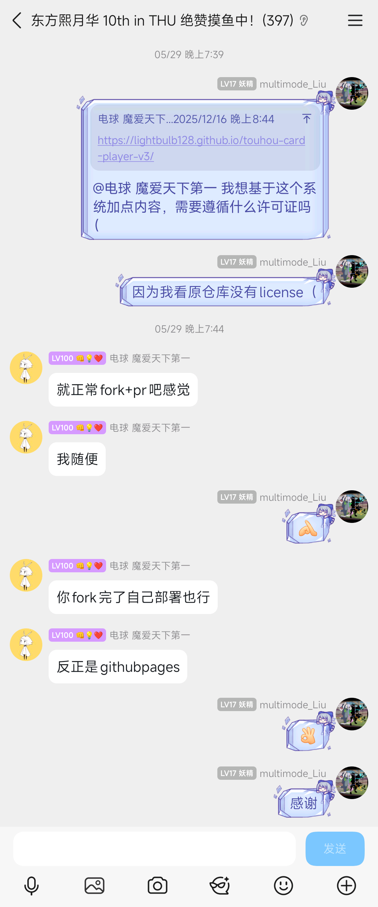

# 上游授权记录

上游仓库 `lightbulb128/touhou-card-player-v3` **没有 LICENSE**（默认保留所有权利）。
本项目就其使用与再发布征询过作者，往来原文如下 —— 存档即凭据。

## 截图说了什么（2025-12-16，QQ 群）

- 本项目作者贴出上游地址并提问：「我想基于这个系统加点内容，需要遵循什么许可证吗」
  「因为我看原仓库没有 license」。
- 对方答复：「就正常 fork+pr 吧感觉」「我随便」「你 fork 完了自己部署也行」「反正是 githubpages」。
- 即：**fork、修改、自行部署**已获同意。

## 授权方身份

截图中的 QQ 用户「电球 魔爱天下第一」**已确认即上游 GitHub 账号 `lightbulb128` 本人**
（由项目作者核对确认）。

## 一处残余风险（已由项目作者判断并接受）

截图没有逐字写出「可按 MIT 再许可」——字面上覆盖的是"你自己 fork 与部署"，
而 `LICENSE` 里的 MIT 是**向第三方**授权。

项目作者的判断：对方「我随便」的表述已足够宽泛，且本项目的实际用法
（fork + 自行部署，对方原话「你 fork 完了自己部署也行」）正是对方明确点头的场景，
因此按 MIT 发布成立。

留这条只为可追溯，不是待办。若日后想要更硬的凭据，补一句即可：
「我打算把这份 fork 按 MIT 开源，可以吗」。
